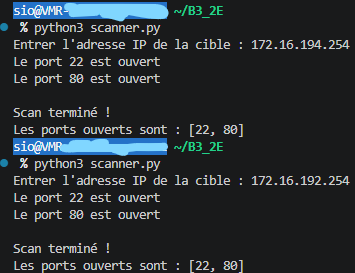

# TP - 03. Python - Scanner de port

**Nom :** Emma-Gabrielle FOUGEROUX<br>
**Classe :** BTS SIO SLAM 2<br>
**Date :** 22/09/2026

---

## Présentation et Objectifs

Ce projet consiste à développer un scanner de ports TCP en Python capable de détecter rapidement les ports ouverts sur une machine cible (locale ou distante) en tirant parti du multithreading.  
L'objectif est d'analyser un hôte afin d'identifier les services et ports d'écoute actifs.

### Compétences et Notions abordées :
- **Réseau :** Modèle TCP/IP, sockets réseau, communication client/serveur, analyse des ports *well-known* (1-1024).
- **Programmation concurrente :** Utilisation de threads (`threading`) et files d'attente synchronisées (`queue.Queue`) pour optimiser drastiquement le temps d'analyse.
- **Sensibilisation à la sécurité :** Découverte de la surface d'attaque et appréhension du cadre légal.

---

## Sommaire

- [Fonctionnalités](#fonctionnalités)
- [Architecture technique](#architecture-technique)
- [Prérequis](#prérequis)
- [Installation et Exécution](#installation-et-exécution)
- [Résultats des tests et Validation](#résultats-des-tests-et-validation)
- [Interprétation des services détectés](#interprétation-des-services-détectés)
- [Cadre légal](#cadre-légal)
- [Perspectives d'amélioration](#perspectives-damélioration)

---

## Fonctionnalités

- Scan automatique des **Well-Known ports** (plage standard de 1 à 1024).
- Utilisation d'une file d'attente thread-safe (`queue.Queue`) pour la distribution équitable des tâches.
- Exécution parallèle via un pool de **500 threads** pour accélérer le balayage.
- Détection des services en écoute et affichage dynamique des résultats en temps réel.

---

## Architecture technique

Le script repose exclusivement sur la bibliothèque standard de Python :

| Module | Rôle |
| :--- | :--- |
| `socket` | Création de sockets réseau TCP (`SOCK_STREAM`) et tentative de connexion via `connect()`. |
| `threading` | Gestion de l'exécution concurrente pour paralléliser les tests de connexion. |
| `queue.Queue` | Structure de données synchronisée garantissant qu'aucun port n'est scanné deux fois et évitant les conflits d'accès. |

### Flux d'exécution

1. **Initialisation** : Saisie de l'adresse IP de la cible et génération de la plage de ports (1 à 1024).
2. **Distribution** : Remplissage de la file d'attente (`queue`).
3. **Traitement parallèle** : Lancement de 500 threads exécutant la fonction de connexion.
4. **Synchronisation** : Attente de la fin de tous les threads via `join()` avant l'affichage de la liste triée des ports ouverts.

---

## Prérequis

- Python 3.8 ou version ultérieure.
- Aucune bibliothèque tierce requise (`socket`, `threading` et `queue` sont intégrés par défaut).

---

## Installation et Exécution

### 1. Cloner le dépôt

```bash
git clone [https://github.com/<votre-utilisateur>/TP-Python-Port-Scanner.git](https://github.com/egfougeroux/TP03_Python-Scanner_de_port.git)
cd TP-Python-Port-Scanner
```

### 2. Lancer le scanner

```bash
python3 scanner.py
```

## Résultats des tests et Validation

Les tests ont été réalisés depuis l'environnement de travail (`sio@VMR-194-fougerouxe`) vers deux machines cibles du réseau de TP (`172.16.194.254` et `172.16.192.254`).



---

## Interprétation des services détectés

D'après les standards réseau et la liste IANA des ports réservés :

| Port | Protocole | Service | Description & Rôle |
| :---: | :---: | :---: | :--- |
| **22** | TCP | **SSH** (*Secure Shell*) | Permet l'administration et la prise de contrôle à distance sécurisée du serveur en ligne de commande. |
| **80** | TCP | **HTTP** (*HyperText Transfer Protocol*) | Indique la présence d'un serveur web actif (Apache, Nginx, etc.) diffusant des pages sans chiffrement. |

---

## Cadre légal

> **Avertissement :**
> L'utilisation d'outils de scan de ports sur des infrastructures sans autorisation formelle et écrite de leur propriétaire constitue un acte répréhensible.
>
> En droit français, l'**article 323-7 du Code pénal** réprime expressément la tentative d'accès frauduleux à un système de traitement automatisé de données au même titre que l'infraction consommée, ce qui inclut les phases de reconnaissance non autorisées.
> Cet outil doit être employé exclusivement sur votre propre matériel ou dans le cadre des travaux pratiques autorisés sur les machines virtuelles de laboratoire.

---

## Perspectives d'amélioration

- [ ] Ajout d'arguments en ligne de commande avec `argparse` (ex: `--target`, `--ports`).
- [ ] Paramétrage d'un délai d'expiration réseau (socket.settimeout()) pour accélérer le scan des ports filtrés.
- [ ] Récupération des bannières applicatives (*banner grabbing*) pour identifier la version exacte des services distants.
- [ ] Comparaison des résultats de détection avec l'outil de référence **Nmap**.
